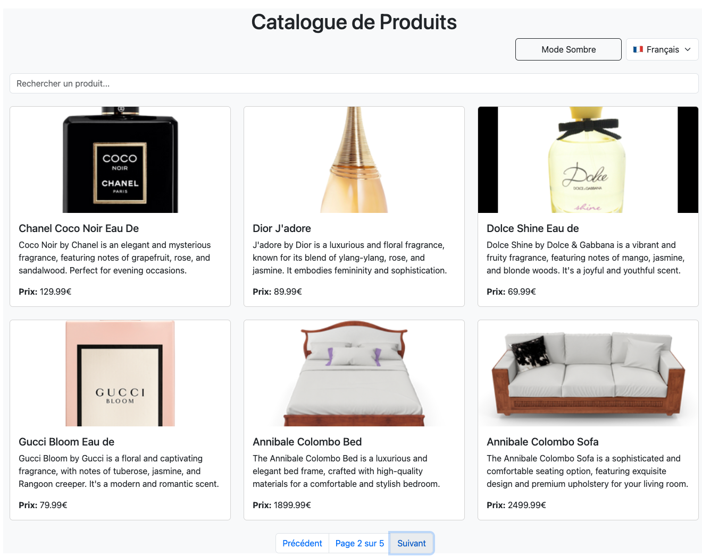

# TP React Hooks - Application de Gestion de Produits

Ce TP a pour objectif de mettre en pratique l'utilisation des Hooks React (useState, useEffect, useContext) ainsi que la création de Hooks personnalisés.

## Installation et configuration initiale

1. Cloner le dépôt :
```bash
git clone https://github.com/pr-daaif/tp-react-hooks.git
cd tp-react-hooks
```

2. Créer votre propre dépôt sur Github et changer le remote :
```bash
# Supprimer le remote origine
git remote remove origin

# Ajouter votre nouveau remote
git remote add origin https://github.com/[votre-username]/tp-react-hooks.git

# Premier push
git push -u origin main
```

3. Installer les dépendances :
```bash
npm install
```

4. Lancer l'application :
```bash
npm start
```

## Instructions pour le TP

Pour chaque exercice :
1. Lisez attentivement l'énoncé
2. Implémentez la solution
3. Testez votre implémentation (pensez à faire des copies d'écran)
4. Mettez à jour la section correspondante dans ce README avec :
   - Une brève explication de votre solution
   - Des captures d'écran montrant le fonctionnement
   - Les difficultés rencontrées et comment vous les avez résolues
5. Commitez vos changements avec un message descriptif

### Exercice 1 : État et Effets 
#### Objectif : Implémenter une recherche en temps réel

- [ ] 1.1 Modifier le composant ProductSearch pour utiliser la recherche
- [ ] 1.2 Implémenter le debounce sur la recherche
- [ ] 1.3 Documenter votre solution ici

_Votre réponse pour l'exercice 1 :_
```
Expliquez votre solution ici : 

1.1 Modification du composant ProductSearch
Le composant ProductSearch utilise maintenant un état local searchTerm, mis à jour à chaque saisie. La valeur est ensuite transmise au parent (App.js) via la prop onSearch, qui la redirige vers ProductList pour filtrer les produits affichés.


1.2 Implémentation du debounce sur la recherche
Un délai a été ajouté avant l’exécution de la recherche pour éviter de déclencher une requête à chaque frappe. Un setTimeout de 500ms attend la fin de la saisie avant de transmettre la valeur au parent via onSearch. Si l’utilisateur continue de taper, le précédent setTimeout est annulé avec clearTimeout.


[Ajoutez vos captures d'écran]
```


### Exercice 2 : Context et Internationalisation
#### Objectif : Gérer les préférences de langue

- [ ] 2.1 Créer le LanguageContext
- [ ] 2.2 Ajouter le sélecteur de langue
- [ ] 2.3 Documenter votre solution ici

_Votre réponse pour l'exercice 2 :_
```
Expliquez votre solution ici: 


2.1 Création du LanguageContext

J'ai créé un LanguageContext dans App.js pour stocker la langue sélectionnée par l'utilisateur. Cela permet aux autres composants d'accéder à la langue actuelle et d'afficher le texte correspondant.


2.2 Ajout du sélecteur de langue

J'ai ajouté un useState pour la langue dans App.js et un <select> permettant à l'utilisateur de choisir entre le français et l'anglais. Cette valeur est stockée dans LanguageContext et utilisée dans d'autres composants.


2.3 Adaptation des composants

Dans ProductSearch.js et ProductList.js, j'ai utilisé useContext(LanguageContext) pour récupérer la langue sélectionnée et adapter les textes affichés (placeholder, messages d’erreur, etc.).


[Ajoutez vos captures d'écran]
```


### Exercice 3 : Hooks Personnalisés
#### Objectif : Créer des hooks réutilisables

- [ ] 3.1 Créer le hook useDebounce
- [ ] 3.2 Créer le hook useLocalStorage
- [ ] 3.3 Documenter votre solution ici

_Votre réponse pour l'exercice 3 :_
```
Expliquez votre solution ici


3.1 Création du hook useDebounce
J'ai créé un hook personnalisé useDebounce qui accepte une valeur et un délai. Ce hook utilise useState pour stocker la valeur temporisée et useEffect avec setTimeout pour déclencher la mise à jour après le délai spécifié. Il gère également le nettoyage des timers précédents avec clearTimeout. Ce mécanisme évite d'exécuter des opérations coûteuses à chaque changement de valeur.

3.2 Création du hook useLocalStorage
J'ai implémenté un hook useLocalStorage qui étend le fonctionnement de useState en ajoutant la persistance dans le localStorage du navigateur. Il prend une clé et une valeur initiale, vérifie si une valeur existe déjà dans le localStorage, et retourne un tableau [valeur, fonction] similaire à useState. La fonction de mise à jour synchronise automatiquement l'état avec le localStorage, permettant aux préférences utilisateur de persister entre les sessions.

3.3 Intégration dans l'application
Ces hooks sont maintenant utilisés dans l'application : useDebounce dans ProductSearch pour optimiser la recherche, et useLocalStorage dans App.js pour sauvegarder le thème et la langue choisis par l'utilisateur. Cette approche améliore les performances et l'expérience utilisateur tout en gardant le code modulaire et réutilisable.


[Ajoutez vos captures d'écran]
```


### Exercice 4 : Gestion Asynchrone et Pagination
#### Objectif : Gérer le chargement et la pagination

- [ ] 4.1 Ajouter le bouton de rechargement
- [ ] 4.2 Implémenter la pagination
- [ ] 4.3 Documenter votre solution ici

_Votre réponse pour l'exercice 4 :_
```
Expliquez votre solution ici:


J’ai créé deux fonctions nextPage et previousPage pour gérer la navigation entre les pages. Ces fonctions mettent à jour l’état currentPage, puis découpent le tableau complet des produits (allProducts) pour n’afficher que 6 produits par page à l’aide de slice(). L’état totalPages est calculé automatiquement en divisant le nombre total de produits par 6.


J’ai ajouté une fonction reload dans le hook useProductSearch qui relance la récupération des données depuis l’API et réinitialise la pagination à la première page. Un bouton "Actualiser" dans ProductList appelle cette fonction, permettant de rafraîchir manuellement la liste des produits.


[Ajoutez vos captures d'écran]
```


## Rendu

- Ajoutez l'URL de votre dépôt Github dans  **Classroom** et envoyer la réponse dès le démarage de votre projet.
- Les push doivent se faire au fûr et à mesure que vous avancez dans votre projet.
- Le README.md doit être à jour avec vos réponses et captures d'écran. 
- Chaques exercice doit faire l'objet d'au moins un commit avec un message mentionnant le numéro de l'exercice.